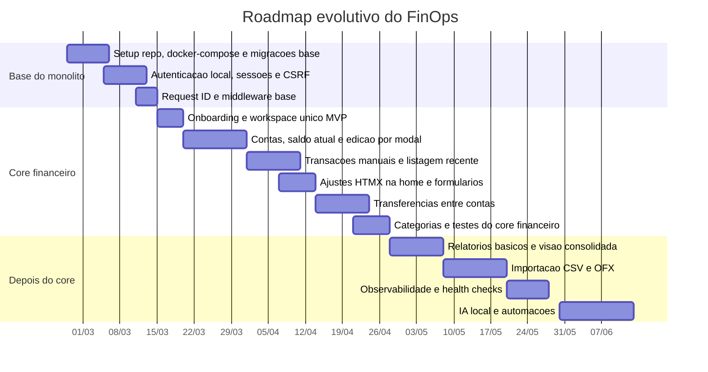

# finops

## Roadmap

## Estado atual

- Base do monólito concluída: app sobe com Go + Postgres + Redis, autenticação por sessão e proteção CSRF já estão implementadas.
- Onboarding do workspace MVP concluído: usuário autenticado sem workspace é direcionado para criação inicial.
- Core financeiro em andamento: contas já possuem criação, listagem e edição; transações manuais já possuem cadastro e listagem recente na home.
- O foco atual é fechar o slice `contas -> transações -> transferências` antes de abrir novas frentes.

## Próximos passos

- Fechar UX de contas na home: garantir que saldo atual e edição por modal fiquem consistentes.
- Fechar UX de transações: preservar estado do formulário em erro e manter a listagem recente consistente.
- Implementar transferências entre contas como duas transações vinculadas.
- Consolidar testes dos controllers e fluxos HTMX do core financeiro.

## Critérios de aceitação do bloco atual

- **Contas**: criar e editar conta pela home, com retorno consistente via modal e saldo atual correto.
- **Transações**: registrar transação manual e ver o efeito refletido na home.
- **Transferências**: movimentar valor entre duas contas sem distorcer o saldo consolidado.
- **Qualidade**: `go test ./...` passando ao final de cada bloco.
