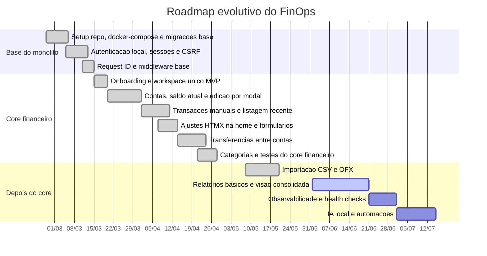

# finops


## Roadmap


## Estado atual

MVP entregue. Todo o core financeiro está concluído e o foco atual é o bloco de relatórios e automações.

**Concluído:**
- Base do monólito: app sobe com Go + Postgres + Redis, autenticação por sessão e proteção CSRF.
- Onboarding do workspace MVP: usuário autenticado sem workspace é direcionado para criação inicial.
- Core financeiro completo: contas (criação, listagem, edição por modal), transações manuais, transferências entre contas e categorias.
- Importação OFX e CSV: upload, preview e confirmação de lançamentos via arquivo.

**Em andamento:**
- Relatórios básicos e visão consolidada (gastos por categoria, comparativo mensal, evolução de saldo).
- Camada LLM: tools financeiras para consulta em linguagem natural sobre os dados do workspace.

## Próximos passos

- Finalizar queries SQL de relatórios e regenerar com `make sqlc`.
- Implementar `ReportService` (gastos por categoria, comparativo mensal, histórico de saldo, listagem filtrada).
- Construir controller e templates de relatórios (4 views + chat LLM).
- Expor LLM tools para consultas em linguagem natural sobre os dados financeiros.
- Observabilidade: health checks e métricas básicas.

## Critérios de aceitação do bloco atual

- **Contas**: criar e editar conta pela home, com retorno consistente via modal e saldo atual correto.
- **Transações**: registrar transação manual e ver o efeito refletido na home.
- **Transferências**: movimentar valor entre duas contas sem distorcer o saldo consolidado.
- **Qualidade**: `go test ./...` passando ao final de cada bloco.
- **Gastos por categoria**: total agrupado por categoria em qualquer período, excluindo transferências.
- **Comparativo mensal**: receitas × despesas mês a mês.
- **Evolução de saldo**: curva de saldo acumulado com âncora correta no início do período.
- **Listagem filtrada**: paginação com filtros de conta, categoria, direção e período.
- **Chat LLM**: pergunta em linguagem natural retorna resposta baseada nos dados do workspace.
- **Qualidade**: `go test ./...` passando ao final de cada etapa.

## Env Variables
```
DB_HOST=localhost
DB_PORT=5432
DB_NAME=finops
DB_USER=finops
DB_PASSWORD=finops
```
