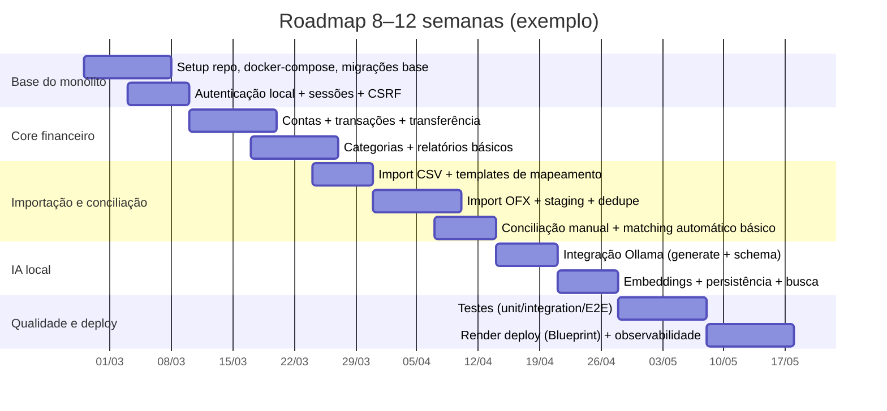

# finops

## Roadmap

Critérios de aceitação por marco (amostra):
- **Base**: subir app + DB via compose; `templ generate --watch` funcionando; login OK com cookie seguro e CSRF em POSTs. 
- **Core**: criar transação e ver refletir no saldo; transferência não conta em relatórios.  
- **Import**: importar OFX/CSV e deduplicar por `FITID`/hash; staging revisável. 
- **IA**: categorização retorna JSON válido via schema (sem texto extra) e é auditada; embeddings gerados via `/api/embed`.
- **Deploy**: `render.yaml` provisiona web+DB; backups planejados; logs sem dados sensíveis.