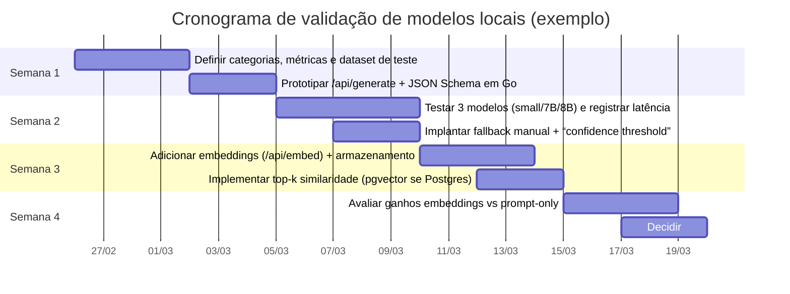

# Relatório técnico: LLMs locais com Ollama no monólito Go+htmx+templ e decisão Postgres vs MySQL no Render

## Resumo executivo

Este relatório cobre duas decisões centrais do seu projeto: (1) **quais modelos abertos rodar localmente via Ollama** para tarefas de IA financeira (categorização, sugestões e análise), e (2) **Postgres vs MySQL no Render** para deploy, com foco em operação, backups, custo e capacidade de evoluir para recursos de embeddings/vetores. As fontes prioritárias exigidas foram consultadas e usadas: **render.com** (documentação e pricing) e **templ.guide** (documentação de templ e segurança). citeturn6view0turn26view0turn24search2

A conclusão prática para o seu caso (app monolítico pessoal, mas com opção de evoluir) é:

- **Banco no Render:** prefira **Render Postgres (gerenciado)** como padrão. Ele oferece *PITR (point-in-time recovery)* e *exports lógicos* em instâncias pagas, read replicas e high availability em instâncias maiores, além de permitir **pgvector** (útil para embeddings) via `CREATE EXTENSION vector;`. citeturn6view0turn6view1turn6view2turn7view0  
- **MySQL no Render:** é viável, mas como **self-host com Persistent Disk**, aumenta o esforço operacional e tem limitações relevantes (não escala horizontalmente com disco, perde zero-downtime deploy, backups exigem `mysqldump` e *restaurar snapshot de disco para DB é explicitamente não recomendado*). citeturn6view3turn26view0
- **IA local com Ollama:** para começar com alta chance de “dar certo” em laptop, a estratégia mais robusta é **separar**:
  - um **LLM instruct pequeno/médio** para raciocínio e geração (ex.: 3B–8B para CPU/GPU modesta), e
  - um **modelo de embeddings** para memória semântica, regras assistidas e categorização por similaridade (ex.: `embeddinggemma`, `qwen3-embedding`, `all-minilm`). citeturn10search1turn11view0turn13view0turn4search16
- **Formato e desempenho:** para rodar local, o ecossistema **GGUF + quantização (Q4/Q8)** é a forma mais comum de reduzir RAM/VRAM. Em medições do `llama.cpp`, um Llama 3.1 8B em **Q4_K_M** fica na faixa de ~4–5 GiB e o FP16 fica ~15 GiB; além disso, quantizações mudam bastante a taxa de geração (t/s) na prática. citeturn18view0

## Modelos abertos compatíveis com Ollama

A compatibilidade com Ollama acontece por três caminhos, com impactos diretos no “quão fácil” é usar um modelo:

1) **Modelos do registry do Ollama** (catálogo em `ollama.com/library`) — instalação simples via `ollama pull`. Esse catálogo (em 2026-02-25) inclui várias famílias: Llama 3.x/2, Qwen 1.5/2/2.5/3, DeepSeek, Gemma 1/2/3, Phi 2/3/4, Mistral/Mixtral, Falcon, StarCoder2 e várias outras, além de modelos de embeddings específicos. citeturn13view0turn4search16turn10search14

2) **Importar um GGUF “base model”** via `Modelfile` (`FROM /path/to/file.gguf`). Isso permite usar praticamente qualquer modelo que você consiga converter para GGUF (geralmente via `llama.cpp`). citeturn5search4turn9view1turn18view0

3) **Importar/adicionar adapters (Q)LoRA** via `ADAPTER` no `Modelfile`. Isso habilita “customização” sem precisar empacotar um modelo inteiro novo (desde que o adapter esteja em GGUF e seja compatível com o modelo base). citeturn5search4turn9view1

### Lista abrangente das famílias de modelos “relevantes” no ecossistema Ollama

Abaixo está uma lista **abrangente por família** (não por cada variação/finetune comunitário) dos modelos abertos mais relevantes para rodar localmente, cobrindo explicitamente as famílias citadas por você e as que o catálogo do Ollama destaca com grande adoção:

- **Llama / CodeLlama (Llama 2, Llama 3, Llama 3.1/3.2/3.3/4)** — modelos gerais e de código, amplamente usados no Ollama. citeturn13view0turn22search0turn22search20  
- **Mistral / Mixtral** — modelos com licença permissiva (Apache 2.0), muito fortes em custo/qualidade; Mixtral é MoE, com perfil de desempenho particular. citeturn23search2turn23search10turn14search0  
- **Gemma (Gemma 1/2/3, CodeGemma, EmbeddingGemma, Gemma 3n)** — pesos abertos sob “Gemma Terms of Use”; inclui opção de embeddings. citeturn22search13turn22search1turn13view0turn4search16  
- **Qwen (Qwen 1.5/2/2.5/3 + coder + embeddings)** — forte em multilinguismo e tool use; muitas variantes sob Apache 2.0 (mas é importante checar variações específicas). citeturn13view0turn22search10turn22search6turn4search16  
- **DeepSeek (R1, V3, coder, distill)** — foco em raciocínio; licenças permissivas (MIT) para a série R1 conforme repositório oficial. citeturn13view0turn22search11turn22search31  
- **Phi (Phi-2, Phi-3, Phi-4 e variantes reasoning)** — modelos pequenos, bons para rodar em recursos limitados; a família Phi é divulgada como open source sob MIT License. citeturn23search4turn23search8turn13view0  
- **Falcon / Falcon2 / Falcon3** (Technology Innovation Institute) — família tradicional; a própria página do modelo Falcon no catálogo indica recomendações de memória por escala e alerta de licenças diferentes em variantes grandes. citeturn14search1turn14search2turn14search8  
- **MPT** (MosaicML/Databricks, ex.: MPT-7B) — Apache 2.0; não é “primeira classe” via Safetensors no Ollama, mas é **convertível** para GGUF e utilizável via import. citeturn16search0turn5search4  
- **RedPajama (INCITE)** — Apache 2.0, com versões base/instruct/chat; tipicamente convertível para GGUF. citeturn16search1turn16search29turn5search4  
- **Pythia (EleutherAI)** — Apache 2.0; convertível para GGUF e usado em muitos cenários de pesquisa/educação. citeturn16search2turn5search4  
- **Vicuna** — finetune derivado (ex.: de Llama 2) e, portanto, **herda restrições da licença base** (há variantes antigas “non-commercial” e variantes Llama 2). citeturn16search7turn16search11  
- **Modelos de embeddings** no Ollama: `embeddinggemma`, `qwen3-embedding`, `all-minilm`, além de alternativas como `nomic-embed-text`, `bge-m3`, etc. citeturn10search1turn4search16turn10search14

### Memória/VRAM, quantização e latência: como estimar de forma prática

Para sizing de hardware local, dois fatores dominam:

- **Tamanho dos pesos (weights)**: cai muito com quantização (4-bit vs 8-bit vs FP16).  
- **KV cache** (dependente de contexto, batch e parâmetros de inferência): pode ser relevante, especialmente com contextos longos.

Dados concretos e úteis para calibrar sua intuição:

- No `llama.cpp`, um **Llama 3.1 8B** quantizado em **Q4_K_M** fica ~**4.58 GiB**, em **Q8_0** ~**7.95 GiB**, e **FP16** ~**14.96 GiB**; a tabela também mostra que modelos maiores (ex.: 70B, 405B) crescem rapidamente mesmo em Q4_K_M. citeturn18view0  
- O Ollama indica que o tamanho de contexto padrão pode variar conforme a VRAM disponível (ex.: 4K abaixo de 24 GiB; maior acima disso), o que na prática afeta KV cache e estabilidade em hardwares menores. citeturn4search6  
- O Ollama também comenta concorrência: se há memória suficiente, consegue manter mais de um modelo carregado, e pode processar requests em paralelo; se não, enfileira. citeturn4search2

#### Tabela de referência rápida: classes de modelo e ordem de grandeza de RAM/VRAM (pesos)

A tabela abaixo é uma **regra de bolso** para inferência local, usando como âncora medições/arquivos típicos de quantização (ex.: Llama 3.1 8B do `llama.cpp`) e o comportamento usual de modelos GGUF. citeturn18view0turn14search0

| Classe | Exemplos típicos | Pesos em Q4 (ordem de grandeza) | Pesos em Q8 (ordem de grandeza) | FP16 (ordem de grandeza) | Observação prática |
|---|---|---:|---:|---:|---|
| ~1B–3B | modelos “small” (ex.: 1B/3B) | ~1–2.5 GB | ~2–5 GB | ~3–8 GB | Melhor para CPU-only; resposta rápida, mas menor “profundidade”. |
| ~7B–8B | Mistral 7B / Llama 8B / Qwen 8B | ~4–6 GB | ~8–10 GB | ~15–16 GB | “Sweet spot” para laptop com 6–8GB VRAM (Q4) ou CPU forte. citeturn18view0turn14search0 |
| ~14B | Phi 14B / Qwen 14B | ~8–12 GB | ~14–20 GB | ~28–32 GB | 24GB VRAM costuma rodar Q4 com folga; CPU-only fica lento. |
| ~30B–34B | Qwen 30B, code models 30B | ~18–22 GB | ~30–40 GB | ~60–70 GB | Tipicamente precisa 24GB VRAM (Q4) e tuning de contexto. |
| ~70B | Llama 70B / DeepSeek 70B | ~43 GB (Q4_K_M, exemplo no `llama.cpp`) | ~70–80 GB | ~140GB+ | Exige GPU grande (ou múltiplas/CPU enorme). citeturn18view0 |

> Sobre “latência”: o `llama.cpp` mostra, no mesmo modelo (Llama 3.1 8B), que quantização influencia muito throughput (tokens/s) e tamanho. Esses números **não são universais** (dependem do hardware), mas são bons para comparar *tendências* entre Q4/Q8/FP16. citeturn18view0

### Tabela comparativa de modelos recomendados (texto e embeddings)

A tabela abaixo foca nos modelos **mais úteis** para um app de finanças pessoais local (categorização, explicações, insights e embeddings). Ela não lista cada “community fine-tune”, mas cobre as famílias e opções mais importantes no ecossistema Ollama (incluindo as explicitamente pedidas). citeturn13view0turn10search1turn11view0turn23search4turn22search11

| Modelo/família (uso) | Parâmetros (comuns) | Licença (resumo) | Qualidade/benchmarks públicos (sinal) | Melhor forma de rodar local | Observações |
|---|---:|---|---|---|---|
| Llama 3.2 (instruct) | 1B, 3B | Llama 3.x “Community License” (restrições; não é OSI) citeturn22search0 | Geralmente bom em conversa; útil para tarefas simples | CPU-only (3B em Q4) / GPUs modestas | Ótimo “primeiro modelo” para validar fluxos. citeturn13view0 |
| Mistral 7B (instruct) | ~7.3B | Apache 2.0 (permissiva) citeturn23search2turn14search0 | Publicamente divulgado como muito forte vs modelos maiores | GPU 6–8GB (Q4) ou CPU forte | Página do Ollama mostra Q4_K_M ~4.4GB no pacote típico. citeturn14search0 |
| Mixtral 8x7B | MoE (8 experts) | Apache 2.0 citeturn23search10 | Divulgado como > Llama 2 70B em benchmarks e 6× mais rápido (claim) citeturn23search10 | GPU maior (ideal 16–24GB) | MoE tem perfil de memória/latência diferente; excelente custo/qualidade quando cabe. |
| Qwen 3 (instruct / tool use) | 0.6B–30B+ | Em geral Apache 2.0 em muitas variantes; ver variante citeturn22search10turn22search6 | Forte em tool use; bom multilingue | 8B em GPU 6–8GB; 14B/30B em 24GB | Ollama lista Qwen 3 como família com tool calling. citeturn13view0turn10search7 |
| DeepSeek R1 (reasoning) | de pequenos “distill” até grande | MIT (série R1) citeturn22search11turn22search31 | Foco em reasoning; popular em tarefas difíceis | 7B/14B/32B conforme hardware; 70B exige GPU grande | Bom candidato para “máxima qualidade offline” quando recursos permitem. citeturn13view0 |
| gpt-oss (reasoning/agentic) | 20B e 120B | Apache 2.0 (permissiva) citeturn4search19turn4search17 | Série voltada a raciocínio/agentic | 20B em GPU ~24GB; 120B exige GPU muito grande (ex.: 80GB) citeturn4search17 | Opção “open-weight” forte com licença permissiva (mas é grande e recente). citeturn13view0turn4search19 |
| Phi-3 / Phi-4 (SLM) | 3.8B / 14B | MIT (família Phi) citeturn23search4 | Bom custo/qualidade em modelos pequenos | CPU-only (3.8B) ou GPU modesta | O catálogo do Ollama lista Phi-3 3.8B e 14B. citeturn23search8turn13view0 |
| Falcon (7B/40B/180B) | 7B, 40B, 180B | Licenças variam; alerta em 180B citeturn14search1 | Clássico no ecossistema; depende da variante | 7B em máquina com ~8GB total (catálogo sugere) citeturn14search1 | Útil, mas hoje tende a ser menos “sweet spot” que Mistral/Qwen/Llama para muitos devs. |
| MPT-7B (convertível) | ~6.7B | Apache 2.0 citeturn16search0 | Bom baseline open | Converter p/ GGUF e importar | Serve se você tiver motivo histórico/específico; caso contrário, Mistral 7B costuma ser escolha mais direta no Ollama. |
| RedPajama INCITE (convertível) | ~6.9B | Apache 2.0 citeturn16search1turn16search29 | Boa opção histórica de base/instruct | Converter p/ GGUF e importar | Relevante, mas “geração anterior” para muitos usos. |
| Pythia (convertível) | 6.9B+ | Apache 2.0 citeturn16search2 | Bom para experimentação e pesquisa | Converter p/ GGUF e importar | Útil em pipelines de avaliação e datasets. |
| **EmbeddingGemma** (embeddings) | ~300M | Termos Gemma citeturn4search16turn22search1 | Embedding específico | CPU (rápido) | Recomendado pelo próprio Ollama como embedding. citeturn10search1 |
| **Qwen3-embedding** (embeddings) | 0.6B/4B/8B | Variantes; ver licença; aparece como embedding no Ollama citeturn4search16 | Embedding específico | CPU ou GPU | Bom para vetores com maior “capacidade” (modelos maiores). |
| **all-minilm** (embeddings) | pequeno | permissão depende do modelo; recomendado no Ollama citeturn10search1 | Embedding “leve” | CPU (muito rápido) | Excelente para começar com custo mínimo. |

### Recomendação final por cenário de hardware (offline)

A recomendação abaixo otimiza “chance de sucesso” para finanças pessoais: **precisão suficiente + latência aceitável + licença viável + facilidade no Ollama**. As escolhas usam o catálogo do Ollama e fontes oficiais de licença quando aplicável. citeturn13view0turn14search0turn22search11turn4search19turn23search4turn10search1

- **CPU-only (laptop sem GPU dedicada)**  
  Recomendado: **Llama 3.2 3B** *ou* **Phi-3 Mini (3.8B)** + embeddings **all-minilm** (ou EmbeddingGemma). citeturn13view0turn23search8turn10search1  
  Justificativa: modelos 1B–4B tendem a caber/performar melhor em CPU; embeddings pequenos permitem memória semântica e categorização por similaridade com custo baixo. citeturn10search1turn18view0

- **GPU modesta 6–8GB VRAM (laptop gamer/desktop simples)**  
  Recomendado: **Mistral 7B (instruct)** *ou* **Qwen 3 8B** *ou* **Llama 3.1 8B**, em Q4; embeddings **EmbeddingGemma** ou **Qwen3-embedding (0.6B)**. citeturn14search0turn13view0turn10search1turn18view0  
  Justificativa: 7B–8B quantizado (Q4) é o “sweet spot” mais frequente; Mistral tem licença Apache 2.0 e é forte. citeturn23search2turn18view0turn14search0

- **Servidor com GPU 24GB**  
  Recomendado: **gpt-oss 20B** (se seu foco for reasoning/agentic) *ou* **Qwen 3 14B/30B** (se seu foco for tool use + multilingue), e embeddings **Qwen3-embedding 4B** (se precisar qualidade maior em vetores). citeturn4search17turn4search19turn13view0turn4search16  
  Justificativa: 24GB abre espaço para 14B–30B em Q4, ou 20B “reasoning” com boa licença.

- **Máxima qualidade offline (sem restrição, mas realmente offline)**  
  Recomendado: **DeepSeek R1 70B** *ou* **gpt-oss 120B** (quando houver GPU(s) grandes o bastante). citeturn13view0turn22search11turn4search17  
  Justificativa: estes modelos são grandes e exigem infraestrutura local pesada; `gpt-oss-120b` é descrito como cabendo em uma GPU de 80GB no repositório oficial; já 70B em Q4 tipicamente exige bem mais de 24GB. citeturn4search17turn18view0

## Integração técnica Go ↔ Ollama (texto, JSON estruturado e embeddings) e persistência

Ollama expõe uma API HTTP local em `http://localhost:11434/api` e a mesma API existe para modelos cloud em `https://ollama.com/api` (você pode ignorar cloud se o objetivo é rodar 100% local). citeturn10search0

### Diagrama simples da integração

```mermaid
flowchart LR
  subgraph Host["Host (dev ou prod)"]
    App["Monólito Go (htmx + templ)"]
    Oll["Ollama :11434"]
    DB[("DB (Postgres ou MySQL)")]
  end

  App -->|POST /api/generate\nPOST /api/chat| Oll
  App -->|POST /api/embed (embeddings)| Oll
  App -->|SQL (transações, categorias,\nvetores)| DB
```

A decisão do banco impacta diretamente os embeddings: com Postgres no Render você pode usar **pgvector** como extensão oficial suportada. citeturn7view0turn21search1

### Chamar geração de texto (`/api/generate`) em Go

O endpoint `/api/generate` aceita `model`, `prompt`, `system`, `options` e `stream`. Ele também suporta **saída estruturada** via `format`, podendo ser `"json"` ou um objeto JSON Schema. citeturn9view2

```go
package ollama

import (
	"bytes"
	"context"
	"encoding/json"
	"fmt"
	"net/http"
	"time"
)

type GenerateRequest struct {
	Model   string                 `json:"model"`
	Prompt  string                 `json:"prompt"`
	System  string                 `json:"system,omitempty"`
	Stream  bool                   `json:"stream,omitempty"`
	Format  any                    `json:"format,omitempty"`  // "json" OU um JSON Schema (map / json.RawMessage)
	Options map[string]any         `json:"options,omitempty"` // temperature, num_ctx, etc.
}

type GenerateResponse struct {
	Model         string `json:"model"`
	CreatedAt     string `json:"created_at"`
	Response      string `json:"response"`
	Thinking      string `json:"thinking,omitempty"`
	Done          bool   `json:"done"`
	DoneReason    string `json:"done_reason,omitempty"`
	TotalDuration int64  `json:"total_duration,omitempty"`
	EvalCount     int64  `json:"eval_count,omitempty"`
	EvalDuration  int64  `json:"eval_duration,omitempty"`
}

type Client struct {
	BaseURL string
	HTTP    *http.Client
}

func NewClient() *Client {
	return &Client{
		BaseURL: "http://localhost:11434",
		HTTP: &http.Client{
			Timeout: 120 * time.Second,
		},
	}
}

func (c *Client) Generate(ctx context.Context, req GenerateRequest) (GenerateResponse, error) {
	// Importante: para simplificar parsing, desligue streaming.
	req.Stream = false

	body, err := json.Marshal(req)
	if err != nil {
		return GenerateResponse{}, fmt.Errorf("marshal request: %w", err)
	}

	httpReq, err := http.NewRequestWithContext(ctx, http.MethodPost, c.BaseURL+"/api/generate", bytes.NewReader(body))
	if err != nil {
		return GenerateResponse{}, fmt.Errorf("new request: %w", err)
	}
	httpReq.Header.Set("Content-Type", "application/json")

	resp, err := c.HTTP.Do(httpReq)
	if err != nil {
		return GenerateResponse{}, fmt.Errorf("do request: %w", err)
	}
	defer resp.Body.Close()

	if resp.StatusCode/100 != 2 {
		return GenerateResponse{}, fmt.Errorf("ollama generate HTTP %d", resp.StatusCode)
	}

	var out GenerateResponse
	if err := json.NewDecoder(resp.Body).Decode(&out); err != nil {
		return GenerateResponse{}, fmt.Errorf("decode response: %w", err)
	}
	return out, nil
}
```

### Saída JSON estruturada + validação (JSON Schema)

A API do Ollama permite fornecer um **JSON Schema** em `format` para orientar a resposta do modelo. citeturn9view2

A seguir, um exemplo de categorização automática de transação com saída estritamente validável:

- Prompt pede apenas JSON.
- `format` contém JSON Schema.
- Você valida com `gojsonschema` e faz decode em struct.

```go
package financeai

import (
	"context"
	"encoding/json"
	"fmt"

	"github.com/xeipuuv/gojsonschema"

	"yourapp/internal/ollama"
)

type CategorizeResult struct {
	Category   string  `json:"category"`
	Confidence float64 `json:"confidence"`
	Notes      string  `json:"notes,omitempty"`
}

func CategorizeTransaction(ctx context.Context, oc *ollama.Client, description string, amountCents int64) (CategorizeResult, error) {
	// JSON Schema (mínimo viável).
	schema := map[string]any{
		"type": "object",
		"properties": map[string]any{
			"category": map[string]any{
				"type": "string",
				"enum": []string{
					"ALIMENTACAO",
					"TRANSPORTE",
					"MERCADO",
					"MORADIA",
					"SAUDE",
					"LAZER",
					"EDUCACAO",
					"IMPOSTOS",
					"OUTROS",
				},
			},
			"confidence": map[string]any{
				"type":    "number",
				"minimum": 0,
				"maximum": 1,
			},
			"notes": map[string]any{
				"type": "string",
			},
		},
		"required":             []string{"category", "confidence"},
		"additionalProperties": false,
	}

	prompt := fmt.Sprintf(
		`Classifique a transação a seguir em uma das categorias permitidas.
Responda SOMENTE com JSON (sem markdown, sem texto fora do JSON).

Descrição: %q
Valor (centavos, pode ser negativo): %d`,
		description, amountCents,
	)

	resp, err := oc.Generate(ctx, ollama.GenerateRequest{
		Model:  "mistral:7b-instruct", // troque conforme seu cenário
		Prompt: prompt,
		Format: schema, // <-- JSON schema
		Options: map[string]any{
			"temperature": 0.1,
		},
	})
	if err != nil {
		return CategorizeResult{}, err
	}

	// resp.Response deve ser um JSON string (ex.: {"category":"...","confidence":0.9})
	var raw any
	if err := json.Unmarshal([]byte(resp.Response), &raw); err != nil {
		return CategorizeResult{}, fmt.Errorf("model did not output valid JSON: %w; raw=%q", err, resp.Response)
	}

	// Validar com JSON Schema.
	schemaLoader := gojsonschema.NewGoLoader(schema)
	docLoader := gojsonschema.NewGoLoader(raw)
	result, err := gojsonschema.Validate(schemaLoader, docLoader)
	if err != nil {
		return CategorizeResult{}, fmt.Errorf("schema validation error: %w", err)
	}
	if !result.Valid() {
		return CategorizeResult{}, fmt.Errorf("invalid JSON output: %+v; raw=%v", result.Errors(), raw)
	}

	// Decodificar em struct.
	b, _ := json.Marshal(raw)
	var out CategorizeResult
	if err := json.Unmarshal(b, &out); err != nil {
		return CategorizeResult{}, fmt.Errorf("decode structured output: %w", err)
	}
	return out, nil
}
```

### Embeddings (`/api/embed`) + armazenamento no banco

O endpoint `/api/embed` gera embeddings para um texto ou uma lista de textos. Ele suporta opções como `truncate` e `dimensions` e retorna `embeddings` como lista de vetores. citeturn11view0turn10search1

A documentação do Ollama sugere que embeddings têm dimensionalidade típica **384–1024**, variando por modelo. citeturn10search1

```go
package embeddings

import (
	"bytes"
	"context"
	"encoding/json"
	"fmt"
	"net/http"
	"time"
)

type EmbedRequest struct {
	Model      string      `json:"model"`
	Input      interface{} `json:"input"` // string OU []string
	Truncate   *bool       `json:"truncate,omitempty"`
	Dimensions *int        `json:"dimensions,omitempty"`
	KeepAlive  string      `json:"keep_alive,omitempty"`
}

type EmbedResponse struct {
	Model         string        `json:"model"`
	Embeddings    [][]float32   `json:"embeddings"`
	TotalDuration int64         `json:"total_duration,omitempty"`
	LoadDuration  int64         `json:"load_duration,omitempty"`
	PromptEvalCnt int64         `json:"prompt_eval_count,omitempty"`
}

type Client struct {
	BaseURL string
	HTTP    *http.Client
}

func NewClient() *Client {
	return &Client{
		BaseURL: "http://localhost:11434",
		HTTP: &http.Client{
			Timeout: 120 * time.Second,
		},
	}
}

func (c *Client) Embed(ctx context.Context, req EmbedRequest) (EmbedResponse, error) {
	body, err := json.Marshal(req)
	if err != nil {
		return EmbedResponse{}, fmt.Errorf("marshal request: %w", err)
	}

	httpReq, err := http.NewRequestWithContext(ctx, http.MethodPost, c.BaseURL+"/api/embed", bytes.NewReader(body))
	if err != nil {
		return EmbedResponse{}, fmt.Errorf("new request: %w", err)
	}
	httpReq.Header.Set("Content-Type", "application/json")

	resp, err := c.HTTP.Do(httpReq)
	if err != nil {
		return EmbedResponse{}, fmt.Errorf("do request: %w", err)
	}
	defer resp.Body.Close()

	if resp.StatusCode/100 != 2 {
		return EmbedResponse{}, fmt.Errorf("ollama embed HTTP %d", resp.StatusCode)
	}

	var out EmbedResponse
	if err := json.NewDecoder(resp.Body).Decode(&out); err != nil {
		return EmbedResponse{}, fmt.Errorf("decode response: %w", err)
	}
	return out, nil
}
```

#### Persistência em Postgres (recomendado no Render): pgvector

No Render Postgres, `pgvector` é suportado e habilitável por `CREATE EXTENSION vector;`. citeturn7view0turn21search9  
O `pgvector` define operadores para busca por similaridade, incluindo cosine (`<=>`). citeturn21search1

Exemplo de DDL:

```sql
-- Habilitar extensão (uma vez por DB).
CREATE EXTENSION IF NOT EXISTS vector;

CREATE TABLE transaction_embeddings (
  id                BIGSERIAL PRIMARY KEY,
  transaction_id    BIGINT NOT NULL,
  model             TEXT NOT NULL,
  embedding         vector(768) NOT NULL,
  created_at        TIMESTAMPTZ NOT NULL DEFAULT now()
);

-- Índice (opcional, depende do volume e estratégia)
-- CREATE INDEX ON transaction_embeddings USING ivfflat (embedding vector_cosine_ops);
```

Consulta de “mais similares” (cosine):

```sql
SELECT transaction_id
FROM transaction_embeddings
ORDER BY embedding <=> $1
LIMIT 10;
```

#### Persistência em MySQL: alternativa pragmática

Como MySQL no Render tende a ser self-host (MySQL 8.0/5.7) e sem `pgvector`, o caminho mais simples é armazenar o embedding como:

- `JSON` (array de floats), ou  
- `BLOB` (float32 little-endian), com busca sem índice (ou com infra extra).

Para um app pessoal, costuma funcionar, porém perde a ergonomia e performance de buscas vetoriais indexadas que Postgres+pgvector oferece. citeturn7view0turn6view3

### Conexão com htmx/templ: fragmentos e CSP (implicação direta para segurança)

Embora o foco aqui seja IA/DB, há um ponto de integração importante com sua stack:

- `templ` suporta **Fragments** para renderizar apenas partes do template — padrão muito útil quando você usa htmx para updates parciais. citeturn24search4turn24search18  
- Para endurecer XSS, `templ` documenta uso de **nonce** via `templ.WithNonce` para compatibilizar com CSP estrito (evitando `unsafe-inline`). citeturn24search0turn24search9

Isso importa porque qualquer endpoint htmx que retorna fragmentos pode ser uma superfície grande de XSS se você misturar HTML e dados não sanitizados.

## Fine-tuning / LoRA: o que o Ollama suporta e workflow recomendado

### O que o Ollama faz (e o que não faz)

- O Ollama **não é uma ferramenta de treinamento** por si só; ele é primariamente um runtime/registry.  
- Ele **suporta aplicar adapters (Q)LoRA** via `ADAPTER` no `Modelfile`. citeturn9view1  
- Ele também documenta como **importar** um GGUF adapter: converter via `convert_lora_to_gguf.py` do `llama.cpp`, e então criar um `Modelfile` com `FROM <modelo-base>` + `ADAPTER /path/to/file.gguf`. citeturn5search4

### Ferramentas externas necessárias para ajustar um modelo

Para um pipeline local/semicloud, o fluxo mais comum é:

1) Treinar (Q)LoRA com **Hugging Face PEFT** (LoRA, AdaLoRA etc.). citeturn5search3turn5search19  
2) Usar quantização/eficiência com **bitsandbytes** (4-bit/8-bit) quando apropriado. citeturn5search10turn8search9  
3) Opcionalmente usar **TRL** (SFTTrainer etc.) para instruction tuning. citeturn5search7turn8search5  
4) Converter o adapter para **GGUF** (`convert_lora_to_gguf.py`) e o base model para GGUF (`convert_hf_to_gguf.py`) usando `llama.cpp`. citeturn5search4turn18view0  
5) Importar no Ollama com `ollama create` + `Modelfile`. citeturn5search4turn9view1

Como alternativa mais “pronta” para devs, ferramentas como Unsloth documentam exportar modelos/quantizações para GGUF e integração com Ollama (incluindo opções de quantização como `q4_k_m`). citeturn5search2turn8search19

### Workflow específico para “classificador/categorizador de transações”

Para finanças pessoais, você costuma ter três níveis de maturidade (recomendado escolher do mais simples ao mais complexo):

**Nível 1 (prompt + JSON schema, sem treino)**  
- Use `format` com JSON Schema e temperatura baixa (como no snippet). citeturn9view2  
- Monte uma taxonomia fixa (categorias pt-BR) e mantenha um validador estrito no backend.

**Nível 2 (embeddings + classificação por similaridade)**  
- Gere embedding da descrição normalizada (“merchant”, “memo”, MCC, etc.).  
- Busque top-k transações históricas rotuladas e infira categoria por votação/ponderação.  
- Esse nível é altamente auditável e costuma reduzir “alucinação”.

**Nível 3 (LoRA para seu domínio)**  
- Construa dataset com: `(descricao, features estruturadas) -> categoria`.  
- Treine LoRA em um modelo pequeno (3B–8B) e compare com baseline nível 1/2.  
- Exporte adapter GGUF e aplique via `ADAPTER`.

**Avaliação (indispensável)**  
- Separe dataset em treino/validação/teste e monitore:
  - acurácia por categoria,
  - taxa de “OUTROS”/baixa confiança,
  - estabilidade em descrições curtas,
  - regressão quando adiciona novos merchants.

## Privacidade e LGPD para IA local (riscos e checklist)

Seu domínio (finanças pessoais) processa **dados pessoais** em alto grau (ex.: renda, histórico de pagamentos e hábitos de consumo são exemplos explícitos de dados pessoais em materiais governamentais). citeturn19search2turn19search0

A **LGPD (Lei 13.709/2018)** define regras para tratamento de dados pessoais, inclusive em meios digitais, e se aplica a operações de tratamento no território brasileiro. citeturn19search0turn19search12  
Diretrizes e materiais da **entity["organization","ANPD","brazil data protection authority"]** também indicam que anonimização/pseudonimização têm caráter contextual e que o processo de anonimização em si pode configurar tratamento de dados pessoais, atraindo o regime da LGPD. citeturn19search1turn19search5

### Local vs API: risco comparado

- **Rodar local (Ollama no seu host):** reduz exposição a terceiros, mas não elimina risco (logs, backups, malware local, acesso indevido).  
- **Rodar via API externa:** adiciona risco de transferência de dados para terceiros e obrigações contratuais adicionais; exige governança mais forte (DPA, retenção, auditoria).

### Checklist objetivo de privacidade (para seu app)

1) **Minimização**: envie ao modelo apenas o que é necessário (ex.: “descrição normalizada + valor + tipo da conta”), evitando nomes completos, IDs e notas longas. citeturn19search0turn19search2  
2) **Pseudonimização**: substitua identificadores por chaves internas antes de mandar para o LLM; guarde a “tabela de tradução” separada, com controle de acesso. citeturn19search9turn19search5  
3) **Logs**: não logar prompts/respostas contendo dados sensíveis; quando necessário, faça *redaction* (mascaramento). A OWASP recomenda evitar exposição de dados sensíveis e há cheat sheets específicas para logging seguro. citeturn19search7turn19search3  
4) **Criptografia em repouso e em trânsito**: trate DB e backups como ativos sensíveis; OWASP recomenda criptografar dados sensíveis em repouso e em trânsito e cuidar de chaves. citeturn19search3  
5) **Retenção**: defina políticas claras (ex.: embeddings podem ser retidos; prompts brutos não).  
6) **Auditoria mínima**: registre eventos (ex.: “categorização automática aplicada”) sem registrar o conteúdo integral do dado financeiro; prefira hashes/IDs.  
7) **Interface**: apresente ao usuário “por que” e “grau de confiança”; permita correção manual (isso também melhora dataset para nível 2/3).  
8) **Backups**: backups são dados pessoais; proteja com criptografia e controles de acesso.

## Postgres vs MySQL no Render e plano de validação

### Comparação: Render Postgres (gerenciado) vs MySQL (self-host + disk)

O Render oferece **Postgres gerenciado**, e para outros datastores (incluindo MySQL) a estratégia é rodar um serviço/contêiner com **Persistent Disk**. citeturn6view5turn26view0

Render Postgres (gerenciado) — pontos documentados:
- Instâncias pagas têm **PITR** e **exports lógicos sob demanda**; instâncias maiores podem ter read replicas e high availability. citeturn6view0turn6view1turn6view2  
- Há documentação detalhando janela de recuperação (ex.: 3 dias Hobby, 7 dias Professional+) e que a restauração cria uma nova instância para validar antes de migrar conexões. citeturn6view1  
- `pgvector` é suportado como extensão e habilitável via `CREATE EXTENSION vector;`. citeturn7view0turn21search9  
- Storage do Postgres é cobrado a **US$ 0.30/GB-mês** (além do compute). citeturn20search3turn25search0

MySQL no Render — pontos documentados:
- Deploy é via Docker/Private Service e o MySQL escreve em `/var/lib/mysql` (mount path precisa bater). citeturn6view3  
- O Render alerta: **restaurar snapshot de disco para recuperar banco não é recomendado**, pois pode corromper/perder dados; recomenda backup lógico via **`mysqldump`**. citeturn6view3turn26view0  
- Persistent disks têm limitações operacionais importantes: um disco só pode estar ligado a **uma instância**, então serviços com disk **não podem escalar horizontalmente**; disk também impede **zero-downtime deploy**. citeturn26view0  
- Discos têm snapshots diários e criptografia em repouso; mas, novamente, não trate snapshot como backup seguro de banco. citeturn26view0

#### Tabela comparativa objetiva (deploy no Render)

| Critério | Render Postgres (gerenciado) | MySQL (self-host no Render) | Impacto prático no seu projeto |
|---|---|---|---|
| Provisionamento | Nativo e guiado pelo dashboard citeturn6view0 | Você mantém container + disk + configs citeturn6view3turn26view0 | Postgres reduz esforço operacional e risco. |
| Backups e recovery | PITR + exports lógicos (pagos) citeturn6view1turn6view0 | Snapshot não recomendado para DB; usar `mysqldump` citeturn6view3turn26view0 | Postgres dá plano de DR mais simples/seguro. |
| HA e escalabilidade | HA (standby + failover) e read replicas em instâncias maiores citeturn6view2turn6view0 | Disk impede múltiplas instâncias; você teria que redesenhar citeturn26view0 | Mesmo monólito, DB vira gargalo: Postgres escala melhor. |
| Vetores/embeddings | pgvector suportado citeturn7view0turn21search1 | Sem equivalente nativo no cenário MySQL 8/5.7; exigiria soluções alternativas | Postgres simplifica features de IA (memória semântica). |
| Custos (ordem de grandeza) | Compute por instância + storage $0.30/GB-mês citeturn25search0turn20search3 | Compute do service + disk (preço do disk pode variar; Render docs não destacam no trecho) | Postgres costuma ter custo “previsível” e menos trabalho humano. |
| Gestão de upgrades | Plataforma cuida de muito do trabalho (versões 13–18 para novas instâncias) citeturn6view0 | Você cuida de upgrades do MySQL container | Em 2026, MySQL 8.0 tem aviso de EoL em abril de 2026 (Oracle) citeturn21search0 |

### Recomendação final: DB no Render

Para o seu monólito de finanças pessoais com roadmap de IA local e embeddings, a recomendação técnica é:

- **Use Render Postgres (gerenciado)** como banco principal no Render.  
  Você ganha PITR/exports lógicos, caminho claro para HA/read replicas e **pgvector** nativo para embeddings, reduzindo complexidade e risco operacional. citeturn6view0turn6view1turn6view2turn7view0

Guarde a opção MySQL no Render para casos em que você tenha um motivo forte (compatibilidade legado), aceitando o trade-off operacional (backup com `mysqldump`, limitações de disk e deploy). citeturn6view3turn26view0

### Cronograma curto para testar/validar modelo local (milestones)

O cronograma abaixo foi desenhado para você **validar rapidamente** (1) qualidade de categorização, (2) tempo de resposta local, (3) estabilidade do JSON estruturado, e (4) estratégia embeddings + DB.



### Fontes consultadas e priorizadas

Fontes prioritárias: documentação oficial do Render (Postgres, backups/PITR/HA, MySQL self-host e Persistent Disks, pricing) e documentação oficial do templ (fragments e CSP/nonce). citeturn6view0turn6view1turn6view2turn6view3turn26view0turn25search0turn24search2turn24search4turn24search0  

Fontes oficiais/primárias complementares: documentação do Ollama (API `/api/generate`, `/api/embed`, compatibilidade OpenAI, import/Modelfile/ADAPTER), catálogo `ollama.com/library`, repositórios e model cards (Hugging Face) para licenças (Llama 3.1, DeepSeek R1, Qwen) e docs do `llama.cpp` para quantização/tamanhos e benchmarks, além de pgvector e PostgreSQL docs de backup. citeturn9view2turn11view0turn10search0turn5search4turn9view1turn13view0turn18view0turn21search1turn20search0turn22search0turn22search11turn22search6