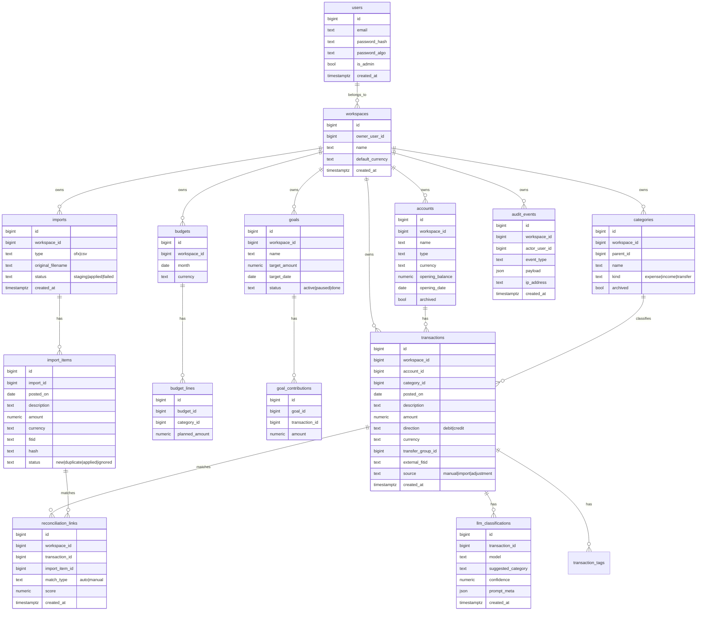
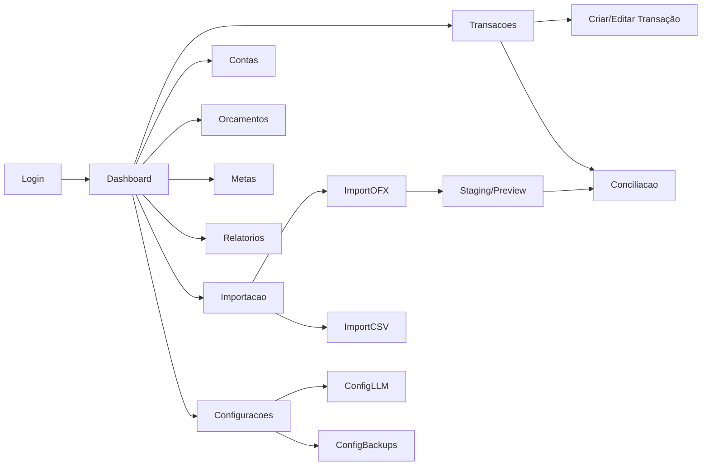
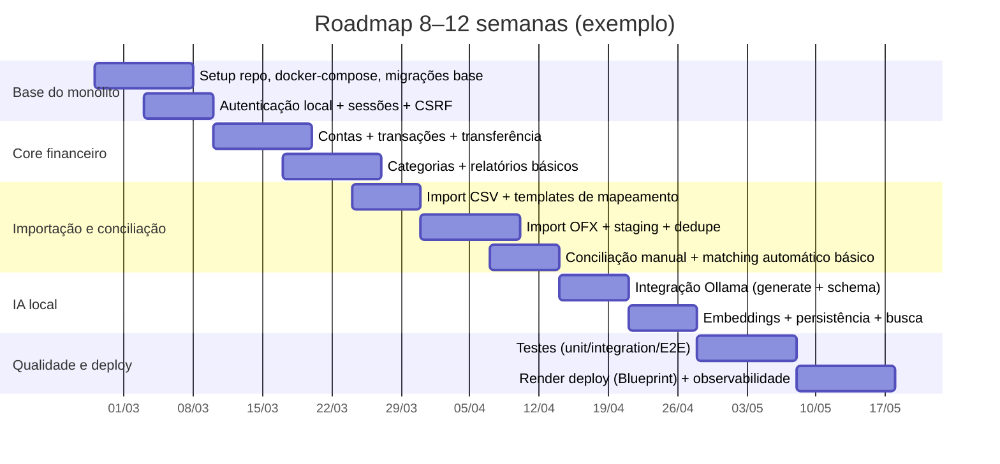

# Especificação funcional e de design para um monólito de controle financeiro pessoal com Go, templ, htmx, Tailwind, DB e Ollama

## Escopo, premissas e fontes prioritárias

Este documento especifica (i) **funcionalidades** e **regras de negócio**, (ii) **fluxos críticos**, (iii) **handlers/APIs internas**, (iv) **modelo de dados (ER + DDL)** para **Postgres e MySQL**, (v) **design de interface (wireframes textuais + componentes Tailwind)**, (vi) **integração com LLM local via Ollama**, e (vii) **segurança/privacidade, testes e deploy** para um **aplicativo monolítico** que roda primeiro no computador do desenvolvedor e depois evolui para **responsivo/mobile**.

Fontes prioritárias (consultadas primeiro, conforme solicitado):  
- **render.com** (documentação de Blueprints/IaC, Postgres gerenciado, discos, MySQL self-host, pricing). citeturn0search0turn0search4turn0search13turn0search1turn0search5turn4search0turn4search33  
- **templ.guide** (fragments, geração de templates, live reload, CSP/nonce e segurança). citeturn0search38turn0search10turn4search11turn4search7turn0search3turn18search2turn18search11  

Premissas explícitas de projeto:
- **Monólito modular**: um binário Go com camadas internas bem definidas (web/UI, domínio, persistência, jobs), evitando microserviços no início.
- **UI server-rendered** com **templ + htmx** (interatividade via requisições HTTP que retornam HTML parcial/fragmentos), evitando SPA. `hx-boost` é opcional para navegação “quase SPA” com fallback progressivo. citeturn13search0turn1search4  
- **Banco relacional**: Postgres *ou* MySQL, com “diferenças quando aplicável” (ex.: `TIMESTAMPTZ` vs `DATETIME`, `JSONB` vs `JSON`, índices). citeturn12search1turn12search3  
- **LLM local** via Ollama: chamadas HTTP para `POST /api/generate` (com `format` em JSON/JSON Schema) e `POST /api/embed` (embeddings) com persistência do resultado/auditoria. citeturn17search10turn17search1turn17search0turn17search8  
- **Deploy**: Docker/docker-compose (dev), `render.yaml` Blueprints no Render, com trilha opcional para Kubernetes (manifests base). Blueprints são IaC do Render e `render.yaml` fica na raiz do repo. citeturn0search0turn0search4  

Observação operacional crítica para IA: o Render **não oferece instâncias com GPU**; para inferência pesada, a trilha “Kubernetes/self-host” (ou outro provedor de GPU) é o caminho. citeturn16search0turn16search2  

## Arquitetura do monólito e pilares técnicos

### Arquitetura lógica

A proposta é um monólito com fronteiras internas claras (Clean-ish Architecture pragmática):

- **Web/UI**: roteamento HTTP, middlewares, autenticação/sessão, handlers htmx (HTML) + endpoints JSON (LLM, import/export).  
- **Domínio**: entidades e regras (transação, transferência, orçamento, meta, conciliação).  
- **Persistência**: repositórios SQL, migrações, transações DB.  
- **Integrações**: Ollama (LLM), importadores OFX/CSV, exportadores, backups.  
- **Jobs internos**: recálculo de saldos, geração de relatórios, rotinas de backup (quando rodando self-host), reconciliação assistida.

### Diagrama de arquitetura

```mermaid
flowchart TB
  subgraph Client["Cliente (Desktop → Mobile responsivo)"]
    Browser["Navegador\nHTML + Tailwind + htmx"]
  end

  subgraph App["Monólito Go"]
    Router["Router + Middlewares\n(sessão, CSRF, logs)"]
    UI["Handlers HTML (templ)\n+ fragments p/ htmx"]
    API["Endpoints JSON\n(import/export, LLM)"]
    Domain["Camada de Domínio\n(regras e validações)"]
    Repo["Repos SQL\n(transações DB)"]
    Audit["Auditoria append-only\n(eventos)"]
  end

  subgraph DB["Banco Relacional (MySQL ou Postgres)"]
    CoreTables["Tabelas core\nusers, accounts, transactions..."]
    Aux["Tabelas auxiliares\nimports, reconciliation, audit..."]
    Vectors["Embeddings\n(pgvector ou fallback)"]
  end

  subgraph LLM["LLM Local"]
    Ollama["Ollama\n/api/generate\n/api/embed"]
  end

  Browser -->|GET/POST (htmx)\nHX-Request| Router
  Router --> UI
  Router --> API
  UI --> Domain
  API --> Domain
  Domain --> Repo
  Repo --> CoreTables
  Repo --> Aux
  Repo --> Vectors
  Domain --> Audit
  API -->|HTTP local| Ollama
  Ollama --> API
```

A UI usa **fragments** para reduzir payload e latência; `templ.Fragment` e `WithFragments` existem justamente para render parcial (ótimo com htmx). citeturn0search10turn0search7  

### Estrutura de pastas recomendada em Go

Estrutura pragmática para monólito:

```text
.
├─ cmd/
│  └─ financeapp/
│     └─ main.go
├─ internal/
│  ├─ app/                 # wiring (DI), config, bootstrap
│  ├─ http/                # router, middlewares, handlers
│  │  ├─ middleware/
│  │  ├─ handlers/
│  │  └─ htmx/             # helpers p/ HX-Request, HX-Trigger, etc.
│  ├─ domain/
│  │  ├─ model/            # entidades + invariantes
│  │  ├─ service/          # casos de uso (application layer)
│  │  └─ validation/
│  ├─ repo/
│  │  ├─ mysql/
│  │  └─ postgres/
│  ├─ migrations/
│  ├─ llm/
│  │  ├─ ollama/           # cliente HTTP
│  │  └─ prompts/
│  ├─ importers/
│  │  ├─ ofx/
│  │  └─ csv/
│  ├─ reports/
│  └─ security/
│     ├─ password/
│     ├─ csrf/
│     ├─ crypto/
│     └─ audit/
├─ web/
│  ├─ templates/           # .templ e componentes
│  ├─ static/              # assets compilados (CSS)
│  └─ i18n/                # pt-BR (e futuro)
├─ scripts/
│  ├─ backup_pg.sh
│  ├─ backup_mysql.sh
│  └─ restore_*.sh
├─ deploy/
│  ├─ docker/
│  │  ├─ Dockerfile
│  │  └─ docker-compose.yml
│  ├─ render/
│  │  └─ render.yaml
│  └─ k8s/
│     ├─ app.yaml
│     └─ db.yaml
└─ Makefile
```

`templ` é compilado para Go; o fluxo típico é `templ generate`, recursivo, e `--watch` existe para live reload em dev. citeturn4search11turn4search7turn4search4  

## Requisitos e fluxos críticos

### Requisitos funcionais detalhados

A tabela abaixo organiza o sistema por módulo, com ênfase nos itens “críticos”.

| Módulo | O que deve fazer | Observações essenciais / aceitação |
|---|---|---|
| Autenticação local | Login/logout; criação de usuário inicial; troca de senha; bloqueio por tentativas (opcional) | Senhas com hash adequado (Argon2id recomendado quando viável). citeturn2search0turn15search0 |
| Multi-usuário (futuro) | Modelo e permissões prontos para múltiplos usuários e workspaces | Incluir `user_id`/`workspace_id` em todas as tabelas core desde o dia 1, para reduzir migração futura. |
| Contas | Criar/editar contas (corrente, cartão, carteira, investimento); saldo inicial; moeda | Saldos derivados de transações (ledger), não “atualizados manualmente” sem trilha. |
| Transações | CRUD; lançamentos (despesa/receita); anexos (opcional); notas | Valores armazenados com tipo exato: Postgres `numeric`, MySQL `decimal`. citeturn12search0turn12search2 |
| Transferências | Transferência entre contas, com transação “dupla” (débito/crédito) e vínculo | Regra: transferência não entra em “gasto/receita” em relatórios agregados. |
| Categorias e regras | Categorias hierárquicas; regras de classificação (regex, merchant map, LLM) | LLM deve sugerir; o usuário confirma (opt-in) e correções alimentam regras. |
| Orçamentos | Orçamento mensal por categoria; rollover opcional | Definir: “orçado”, “gasto”, “restante”, “proj. até fim do mês”. |
| Metas | Metas de reserva/viagem/dívida; aportes vinculados a transações | Tipos: “acumular”, “pagar dívida”, “manter saldo mínimo”. |
| Importação OFX | Importar extratos OFX (SGML e/ou XML); deduplicação; staging; reconciliação | OFX frequentemente vem como arquivo tag-based; campos como `FITID` existem para deduplicação. citeturn10view0turn11view1 |
| Importação CSV | Mapeamento de colunas (data, descrição, valor); templates por banco | Armazenar “perfil de importação” por instituição/arquivo. |
| Exportação | CSV para planilha; export de backup lógico; export de relatórios | Exportar também “auditoria” e “regras” para portabilidade. |
| Relatórios | Dashboard; por categoria; fluxo de caixa; evoluções; saldo por conta | Evitar agregação errada de transferências. |
| Conciliação | Tela de “itens do extrato” vs “transações”; matching por data/valor/descrição/LLM | Guardar status: `unmatched`, `matched`, `duplicate`, `ignored`. |
| Auditoria de ações | Registrar eventos (login, import, edição transação, categorização por IA, restore) | Trilhas de auditoria com controles de integridade são recomendadas em sistemas com “transações valiosas”. citeturn14search23turn14search3 |
| Backups | Backup/restore guiado; snapshot “não é backup de DB” quando self-host | Para MySQL no Render, snapshot de disco não é recomendado; usar `mysqldump`. citeturn0search1turn0search5 |

### Requisitos não-funcionais

- **Performance**: listagens de transações devem paginar e renderizar via fragmentos htmx (ex.: tabela de 50–200 itens). `templ.Fragment` é recomendado para evitar re-render total. citeturn0search10turn13search3  
- **Disponibilidade local**: deve continuar funcionando offline (especialmente a IA local via Ollama).  
- **Portabilidade**: suportar Postgres e MySQL, mas “um DB primário por ambiente”; no Render, Postgres gerenciado é operacionalmente superior (PITR e exports lógicos em instâncias pagas). citeturn0search13turn0search2  
- **Observabilidade**: logs estruturados + correlação por request-id; métricas básicas (latência, erros, jobs). OWASP recomenda logs com integridade e controle de acesso. citeturn14search23turn14search3  
- **Segurança**: CSP com nonce em páginas que incluem scripts; `templ.WithNonce` existe para isso. citeturn0search3turn0search7  
- **Responsividade**: Tailwind é mobile-first e usa prefixos (`sm:`, `md:`) para breakpoints maiores. citeturn1search20  
- **I18n pt-BR**: datas, moeda e labels em pt-BR; centralizar strings em `web/i18n/pt-BR.json` (ou `.toml`/`.yaml`).

### Casos de uso e fluxos passo-a-passo

A seguir, user stories e fluxos para funcionalidades críticas (mantendo foco em “o que acontece na tela” e “o que o backend faz”).

**Login e sessão**  
User story: “Como usuário, quero acessar meu painel com segurança no meu computador.”  
Fluxo:
1. Usuário acessa `/login` → recebe página (templ).  
2. Submete formulário `POST /login` (htmx opcional).  
3. Backend valida credenciais, cria sessão, seta cookie (HttpOnly/Secure/SameSite). Regras OWASP para cookies e sessão recomendam HttpOnly + SameSite como defesas importantes. citeturn15search2turn15search6  
4. Redireciona para `/` (dashboard).

**Cadastro da primeira conta**  
User story: “Como usuário, quero cadastrar minha conta corrente para registrar minhas transações.”  
Fluxo:
1. `/accounts/new` → formulário.  
2. `POST /accounts` → valida (moeda, nome, tipo).  
3. Persistir `accounts` e, se houver saldo inicial, criar transação “SALDO_INICIAL”.

**Criar despesa/receita**  
User story: “Quero registrar uma compra e ver o saldo atualizado.”  
Fluxo:
1. `/transactions/new?account_id=...` → form.  
2. `POST /transactions` → backend:
   - valida campos (data, valor, conta, categoria);
   - insere transação;
   - dispara `HX-Trigger` para atualizar widgets do dashboard/lista. `HX-Trigger` permite eventos client-side após resposta. citeturn13search1  
3. UI atualiza lista (fragment) e card de saldo (fragment).

**Transferência entre contas**  
User story: “Quero transferir dinheiro da conta A para a conta B sem contar como gasto.”  
Fluxo:
1. `/transfers/new` → form com conta origem/destino, valor, data.  
2. `POST /transfers` cria duas transações vinculadas por `transfer_group_id`:
   - Débito na origem (`direction=debit`),
   - Crédito no destino (`direction=credit`),
   - Ambas com `category=TRANSFERENCIA` e exclusão em relatórios de despesas/receitas.

**Importação OFX com deduplicação e staging**  
User story: “Quero importar meu extrato OFX e reconciliar com meus lançamentos.”  
Fluxo:
1. `/imports/ofx` → upload.  
2. `POST /imports/ofx`:
   - armazena arquivo bruto (criptografado/zip) opcional;
   - parseia transações para `import_items` (staging);
   - marca possíveis duplicatas via `FITID`/hash.
3. `/imports/{id}` → tela com itens importados.
4. Usuário seleciona “Aplicar” → backend cria transações para itens aprovados.
5. Usuário entra em reconciliação: “match” manual ou assistido.

OFX é usado como extrato e costuma ser **tag-based** (ex.: `OFXHEADER`, `<STMTTRN>`, `FITID`) e, em variantes antigas, pode vir em OFXSGML; isso influencia o parser. citeturn10view0turn11view1  

**Categorização assistida por IA (opt-in)**  
User story: “Quero que o sistema sugira categoria e eu confirme.”  
Fluxo:
1. Usuário habilita IA em `/settings/llm` (opt-in).  
2. Ao criar/importar transação, backend chama Ollama `POST /api/generate` com `format` JSON Schema para retornar `{category, confidence, rationale}` (ou similar). A API do Ollama suporta `format` como `"json"` ou um JSON Schema. citeturn17search1turn17search8  
3. UI mostra sugestão + botões “Aceitar” / “Corrigir”.  
4. Correção do usuário alimenta regra determinística (regex/merchant) e/ou dataset futuro para adapters (LoRA), mantendo auditoria.

## APIs internas e contrato de handlers

### Convenções gerais

- **HTML endpoints** retornam **páginas completas** (para navegação direta) ou **fragmentos** quando o request vem do htmx.  
- **Fragments**: preferir `templ.Fragment`/`WithFragments` para manter “localidade” em um template único, evitando dezenas de partials. Isso é alinhado ao padrão de “template fragments” em apps hypermedia. citeturn0search10turn13search3  
- **Eventos UI**: usar `HX-Trigger` para sinalizar “atualize cards/saldos” após uma mutação. citeturn13search1  
- **Navegação melhorada**: `hx-boost` pode transformar links/forms em AJAX com fallback quando JS estiver desabilitado. citeturn13search0  
- **CSRF com htmx**: `hx-headers` pode carregar token em cabeçalho e ajudar o backend; não substitui um desenho CSRF robusto (use OWASP como base). citeturn1search0turn2search1  

### Tabela de endpoints principais

> A tabela inclui endpoints “page” + endpoints “fragment” (htmx) + endpoints JSON (import/LLM). Ajuste os nomes conforme seu router.

| Endpoint | Método | Tipo | Request | Response | Códigos |
|---|---|---|---|---|---|
| `/login` | GET | HTML | — | Página login | 200 |
| `/login` | POST | HTML/htmx | form `{email, password, csrf}` | Redirect / fragment mensagens | 200/303/400/401 |
| `/logout` | POST | HTML/htmx | csrf | Redirect | 303 |
| `/` | GET | HTML | — | Dashboard | 200 |
| `/transactions` | GET | HTML | filtros query | Página lista + filtros | 200 |
| `/transactions/table` | GET | htmx fragment | filtros query | `<tbody>...</tbody>` | 200 |
| `/transactions/new` | GET | HTML | query `account_id` | Form transação | 200 |
| `/transactions` | POST | htmx | form transação | fragment “linha criada” + HX-Trigger | 201/400 |
| `/transactions/{id}/edit` | GET | HTML | — | Form edição | 200/404 |
| `/transactions/{id}` | PATCH | htmx | campos editáveis | fragment linha atualizada | 200/400/404 |
| `/transfers/new` | GET | HTML | — | Form transferência | 200 |
| `/transfers` | POST | htmx | form | atualiza duas contas | 201/400 |
| `/imports/ofx` | GET | HTML | — | Tela upload | 200 |
| `/api/imports/ofx` | POST | JSON | multipart upload | `{import_id, stats}` | 201/400/415 |
| `/imports/{id}` | GET | HTML | — | Tela staging/preview | 200/404 |
| `/api/llm/categorize` | POST | JSON | `{transactionDraft, mode}` | `{category, confidence, tokens...}` | 200/400/409 |
| `/api/llm/embed` | POST | JSON | `{text}` | `{vector_dim, embedding_id}` | 200/400 |

### Exemplo de handler htmx + templ com fragments

**Padrão**: o mesmo template pode renderizar página completa e um fragmento específico, usando `WithFragments`. citeturn0search7turn0search10  

```go
// internal/http/handlers/transactions.go
package handlers

import (
	"net/http"

	"github.com/a-h/templ"
)

func (h *Handlers) TransactionsPage(w http.ResponseWriter, r *http.Request) {
	// Carregar dados (filtros, paginação)
	vm := h.buildTransactionsVM(r)

	// Render página completa
	component := h.templates.TransactionsPage(vm)
	templ.Handler(component).ServeHTTP(w, r)
}

func (h *Handlers) TransactionsTableFragment(w http.ResponseWriter, r *http.Request) {
	vm := h.buildTransactionsVM(r)

	// Render apenas fragmento "tableBody"
	component := h.templates.TransactionsPage(vm)

	templ.Handler(component,
		templ.WithFragments("tableBody"),
	).ServeHTTP(w, r)
}
```

E no `.templ`:

```templ
templ TransactionsPage(vm TransactionsVM) {
	<div class="p-4">
		<h1 class="text-xl font-semibold">Transações</h1>

		<table class="w-full text-sm">
			<thead>...</thead>

			<tbody id="tx-table-body">
				@templ.Fragment("tableBody") {
					for _, tx := range vm.Transactions {
						@TransactionRow(tx)
					}
				}
			</tbody>
		</table>
	</div>
}
```

`templ` faz **escape automático, context-aware**, reduzindo risco de XSS; ainda assim, há APIs explícitas para “furar” sanitização (ex.: `SafeURL`, `JSUnsafeFuncCall`), então o padrão deve ser “seguro por default”. citeturn18search2turn18search0turn18search1  

## Modelo de dados e regras de negócio

### Diretrizes de modelagem e tipos monetários

- **Dinheiro não deve ser float**.  
  - Em Postgres, use `numeric` quando precisar de armazenamento e cálculo exatos (ex.: valores monetários). citeturn12search0turn12search20  
  - Em MySQL, use `DECIMAL/NUMERIC` para precisão exata em dados monetários. citeturn12search2turn12search26  
- **Timezone**: em Postgres, preferir `timestamptz`; em MySQL, `datetime` + padronizar UTC na aplicação.  
- **JSON**: Postgres `jsonb` tem suporte forte a índices GIN e busca por chaves/valores com boa performance. citeturn12search1turn12search5  
  MySQL `JSON` não é indexado diretamente; a recomendação é índice via **generated columns**. citeturn12search3turn12search11  

### ER diagram em Mermaid



### Especificação de tabelas e diferenças Postgres vs MySQL

Abaixo, um “núcleo mínimo” com campos, tipos e constraints (por DB). O objetivo é permitir **multi-usuário futuro** e **auditoria** desde o início.

**Tabela `transactions` (diferenças importantes)**

| Campo | Postgres | MySQL | Constraints/índices |
|---|---|---|---|
| `id` | `bigserial` | `bigint auto_increment` | PK |
| `workspace_id` | `bigint` | `bigint` | FK + índice |
| `posted_on` | `date` | `date` | índice composto com `account_id` |
| `amount` | `numeric(19,4)` | `decimal(19,4)` | exato para dinheiro citeturn12search0turn12search2 |
| `description` | `text` | `text` | index opcional (fulltext fica fora do escopo inicial) |
| `external_fitid` | `text` | `varchar(64)` | UNIQUE parcial/composto recomendado (workspace + account + fitid) |
| `created_at` | `timestamptz` | `datetime` | default now/utc |
| JSON meta | `jsonb` | `json` | Postgres: GIN em `jsonb` possível; MySQL: index via generated columns citeturn12search1turn12search3 |

### DDL de referência

#### Postgres (exemplo parcial)

```sql
CREATE TABLE users (
  id BIGSERIAL PRIMARY KEY,
  email TEXT NOT NULL UNIQUE,
  password_hash TEXT NOT NULL,
  password_algo TEXT NOT NULL DEFAULT 'argon2id',
  is_admin BOOLEAN NOT NULL DEFAULT FALSE,
  created_at TIMESTAMPTZ NOT NULL DEFAULT now()
);

CREATE TABLE workspaces (
  id BIGSERIAL PRIMARY KEY,
  owner_user_id BIGINT NOT NULL REFERENCES users(id),
  name TEXT NOT NULL,
  default_currency TEXT NOT NULL DEFAULT 'BRL',
  created_at TIMESTAMPTZ NOT NULL DEFAULT now()
);

CREATE TABLE accounts (
  id BIGSERIAL PRIMARY KEY,
  workspace_id BIGINT NOT NULL REFERENCES workspaces(id),
  name TEXT NOT NULL,
  type TEXT NOT NULL,
  currency TEXT NOT NULL,
  opening_balance NUMERIC(19,4) NOT NULL DEFAULT 0,
  opening_date DATE,
  archived BOOLEAN NOT NULL DEFAULT FALSE
);

CREATE TABLE categories (
  id BIGSERIAL PRIMARY KEY,
  workspace_id BIGINT NOT NULL REFERENCES workspaces(id),
  parent_id BIGINT REFERENCES categories(id),
  name TEXT NOT NULL,
  kind TEXT NOT NULL CHECK (kind IN ('expense','income','transfer')),
  archived BOOLEAN NOT NULL DEFAULT FALSE,
  UNIQUE (workspace_id, name)
);

CREATE TABLE transactions (
  id BIGSERIAL PRIMARY KEY,
  workspace_id BIGINT NOT NULL REFERENCES workspaces(id),
  account_id BIGINT NOT NULL REFERENCES accounts(id),
  category_id BIGINT REFERENCES categories(id),
  posted_on DATE NOT NULL,
  description TEXT NOT NULL,
  amount NUMERIC(19,4) NOT NULL,
  direction TEXT NOT NULL CHECK (direction IN ('debit','credit')),
  currency TEXT NOT NULL,
  transfer_group_id BIGINT,
  external_fitid TEXT,
  source TEXT NOT NULL CHECK (source IN ('manual','import','adjustment')),
  created_at TIMESTAMPTZ NOT NULL DEFAULT now()
);

CREATE INDEX idx_tx_account_posted ON transactions(account_id, posted_on DESC);
CREATE UNIQUE INDEX uq_tx_fitid ON transactions(workspace_id, account_id, external_fitid)
  WHERE external_fitid IS NOT NULL;
```

#### MySQL (exemplo parcial)

```sql
CREATE TABLE users (
  id BIGINT PRIMARY KEY AUTO_INCREMENT,
  email VARCHAR(320) NOT NULL UNIQUE,
  password_hash TEXT NOT NULL,
  password_algo VARCHAR(32) NOT NULL DEFAULT 'argon2id',
  is_admin TINYINT(1) NOT NULL DEFAULT 0,
  created_at DATETIME NOT NULL DEFAULT CURRENT_TIMESTAMP
);

CREATE TABLE workspaces (
  id BIGINT PRIMARY KEY AUTO_INCREMENT,
  owner_user_id BIGINT NOT NULL,
  name VARCHAR(200) NOT NULL,
  default_currency CHAR(3) NOT NULL DEFAULT 'BRL',
  created_at DATETIME NOT NULL DEFAULT CURRENT_TIMESTAMP,
  CONSTRAINT fk_ws_owner FOREIGN KEY (owner_user_id) REFERENCES users(id)
);

CREATE TABLE accounts (
  id BIGINT PRIMARY KEY AUTO_INCREMENT,
  workspace_id BIGINT NOT NULL,
  name VARCHAR(200) NOT NULL,
  type VARCHAR(32) NOT NULL,
  currency CHAR(3) NOT NULL,
  opening_balance DECIMAL(19,4) NOT NULL DEFAULT 0,
  opening_date DATE NULL,
  archived TINYINT(1) NOT NULL DEFAULT 0,
  CONSTRAINT fk_acc_ws FOREIGN KEY (workspace_id) REFERENCES workspaces(id),
  INDEX idx_acc_ws (workspace_id)
);

CREATE TABLE categories (
  id BIGINT PRIMARY KEY AUTO_INCREMENT,
  workspace_id BIGINT NOT NULL,
  parent_id BIGINT NULL,
  name VARCHAR(200) NOT NULL,
  kind VARCHAR(16) NOT NULL,
  archived TINYINT(1) NOT NULL DEFAULT 0,
  CONSTRAINT fk_cat_ws FOREIGN KEY (workspace_id) REFERENCES workspaces(id),
  CONSTRAINT fk_cat_parent FOREIGN KEY (parent_id) REFERENCES categories(id),
  UNIQUE KEY uq_cat_name (workspace_id, name)
);

CREATE TABLE transactions (
  id BIGINT PRIMARY KEY AUTO_INCREMENT,
  workspace_id BIGINT NOT NULL,
  account_id BIGINT NOT NULL,
  category_id BIGINT NULL,
  posted_on DATE NOT NULL,
  description TEXT NOT NULL,
  amount DECIMAL(19,4) NOT NULL,
  direction VARCHAR(8) NOT NULL,
  currency CHAR(3) NOT NULL,
  transfer_group_id BIGINT NULL,
  external_fitid VARCHAR(64) NULL,
  source VARCHAR(16) NOT NULL,
  created_at DATETIME NOT NULL DEFAULT CURRENT_TIMESTAMP,

  CONSTRAINT fk_tx_ws FOREIGN KEY (workspace_id) REFERENCES workspaces(id),
  CONSTRAINT fk_tx_acc FOREIGN KEY (account_id) REFERENCES accounts(id),
  CONSTRAINT fk_tx_cat FOREIGN KEY (category_id) REFERENCES categories(id),

  INDEX idx_tx_account_posted (account_id, posted_on),
  UNIQUE KEY uq_tx_fitid (workspace_id, account_id, external_fitid)
);
```

### Regras de negócio e validações essenciais

- **Direção e sinal do valor**: escolha um padrão único:
  - Opção A: `amount` sempre positivo e `direction` define débito/crédito (mais claro).  
  - Opção B: `amount` com sinal e `direction` derivado (mais compacto).  
  Recomenda-se Opção A para reduzir bugs em relatórios.
- **Transferências**: sempre gerar par de transações com `transfer_group_id` e `kind=transfer`. Transferências não entram em “gastos” nem “receitas”.
- **Recorrências**: modelar como “template” gerador (ex.: `recurring_rules`) que cria transações futuras (job diário), mantendo “origem” e “instância gerada”.
- **Arredondamento**: definir regra contábil (ex.: arredondamento bancário) e não misturar float; usar `numeric/decimal`. citeturn12search0turn12search2  
- **Multi-moeda**: armazenar `currency` por conta e por transação; conversão deve guardar taxa e moeda base do workspace (evita recalcular histórico).
- **Conciliação**:
  - Matching automático por `(data±N dias, valor, similaridade descrição, FITID quando existir)`.
  - Status e ações (ignorar, duplicado, aplicar).
- **Import OFX**: deduplicação primária por `FITID` quando presente; fallback por hash `(posted_on, amount, normalized_description, account_id)`. `FITID` existe para “prevenir duplicação na importação” em layouts OFX de bancos. citeturn10view0turn11view1  

## Design de interface e responsividade

### Princípios de UI/UX

- **Mobile-first**: desenhar primeiro para telas pequenas, depois evoluir com `sm:`, `md:` etc. Tailwind é mobile-first por padrão. citeturn1search20  
- **Interatividade hipermídia**: preferir htmx retornando HTML/fragmentos e mantendo URLs com `hx-push-url` quando útil. citeturn13search2turn13search0  
- **Acessibilidade**: foco visível, labels, tamanhos tocáveis (44px+), e contraste.

image_group{"layout":"carousel","aspect_ratio":"16:9","query":["personal finance dashboard web ui","budget app transaction list interface","mobile finance app transactions screen","expense tracker dashboard tailwind ui"],"num_per_query":1}

### Fluxo de navegação em Mermaid



### Wireframes textuais e componentes Tailwind sugeridos

Abaixo, wireframes “textuais” com classes Tailwind como ponto de partida (não são definitivos; são um mapa implementável).

#### Tela de login

**Layout**: coluna central, simples.

- Container: `min-h-screen flex items-center justify-center bg-slate-50 px-4`
- Card: `w-full max-w-sm bg-white rounded-xl shadow p-6`
- Inputs: `w-full rounded-md border border-slate-300 px-3 py-2 focus:ring-2 focus:ring-slate-600`
- Botão: `w-full rounded-md bg-slate-900 text-white py-2 font-medium hover:bg-slate-800`

#### Dashboard

**Topo**: header com workspace, seletor de mês, botões rápidos.  
**Corpo**: cards (saldo total, gasto do mês, receita, orçamento restante) + gráfico/tabela resumida.

- Grid: `grid grid-cols-1 gap-4 md:grid-cols-2 xl:grid-cols-4`
- Card: `rounded-xl bg-white shadow p-4`
- Widget list: `rounded-xl bg-white shadow p-4 overflow-x-auto`

Para htmx, card pode ser fragment: `#balance-card`, `#budget-card`, etc., atualizados com `HX-Trigger` após mutações. citeturn13search1  

#### Lista de transações

**Padrão**: filtro fixo no topo + tabela responsiva (em mobile, vira lista “cards”).

- Filtros: `flex flex-col gap-2 md:flex-row md:items-end`
- Tabela desktop: `hidden md:table w-full text-sm`
- Lista mobile: `md:hidden space-y-2`
- Linha: `border-b border-slate-200`
- Pill categoria: `text-xs px-2 py-1 rounded-full bg-slate-100`

htmx:
- Paginação com `hx-get="/transactions/table?page=2"` + `hx-target="#tx-table-body"` + `hx-swap="innerHTML"`.
- Manter URL com `hx-push-url="true"` para back/forward quando fizer sentido. citeturn13search2turn13search0  

#### Formulário de transação (criar/editar)

Campos:
- Conta (select), data, descrição, valor, direção (débito/crédito), categoria, tags, nota.
- Bloco IA (se habilitado): “Sugestão da IA” com confiança e botões “Aplicar”/“Corrigir”.

Componentes:
- Seções: `space-y-6`
- Label: `text-sm font-medium text-slate-700`
- Help text: `text-xs text-slate-500`
- CTA: `flex gap-2 justify-end`

#### Tela de categorias/orçamentos/metas

- Categorias: árvore (parent->child), com ações inline (editar/arquivar).
- Orçamentos: tabela `categorias x mês`, com total.
- Metas: cards com progresso (barra): `h-2 rounded bg-slate-200` + `w-[xx%] bg-emerald-500`.

#### Tela importação/exportação

Sessões:
- Upload (OFX/CSV)
- Preview staging
- Deduplicação e “aplicar”
- Export CSV e export backup

#### Tela configurações

Blocos:
- **IA (Ollama)**: URL do Ollama local (`http://localhost:11434`), modelo de categorização, modelo de embeddings, política de retenção de prompts, opt-in. A base URL da API local do Ollama é documentada como `http://localhost:11434/api`. citeturn17search10  
- **Backups**: scripts/cron, destino (pasta local / S3 opcional futuro), retenção.

## Segurança, privacidade, testes e deploy

### Segurança e privacidade (LGPD) com foco prático

A **LGPD** regula tratamento de dados pessoais; em finanças pessoais, itens como “renda, histórico de pagamentos e hábitos de consumo” são exemplos explícitos de dados pessoais em materiais governamentais. citeturn14search0turn14search2  
A ANPD reforça que anonimização/pseudonimização é contextual e que o processo de anonimização pode configurar tratamento de dados pessoais (portanto, sujeito à LGPD). citeturn14search1  

Checklist de segurança e privacidade (implementável):

1) **Senhas**
- Preferir **Argon2id**; o próprio pacote `argon2` em Go sugere Argon2id (`IDKey`) quando você não tem certeza. citeturn15search0  
- Alternativa: bcrypt (amplo suporte), com custo calibrado. citeturn15search1turn2search0  

2) **Sessão**
- Cookie com `HttpOnly`, `Secure` e `SameSite=Lax` (defesa importante contra XSS/CSRF). citeturn15search2turn15search6  
- Preferir cookie “host-only” e sem `Domain`, quando aplicável.

3) **CSRF**
- Recomendação base: **Synchronizer Token Pattern** (token por sessão e validado no servidor) ou **Signed Double-Submit Cookie** (OWASP considera o padrão assinado o mais seguro dentro dessa abordagem). citeturn2search1  
- Com htmx: enviar token via `hx-headers` (ex.: `X-CSRF-Token`) ajuda o backend a validar. citeturn1search0  

4) **XSS**
- `templ` faz escape automático e context-aware, e tem mecanismos de proteção contra injeção (ex.: limitações em `style`, sanitização de classe, URL sanitization). citeturn18search2turn18search11turn18search0  
- Política: banir `templ.JSUnsafeFuncCall` e `templ.SafeURL` em caminhos que interpolam dados do usuário; permitir apenas com code review e justificativa. citeturn18search1turn18search0  
- CSP com nonce: `templ.WithNonce` permite CSP mais estrita sem `unsafe-inline`. citeturn0search3turn0search26  

5) **Auditoria e logs**
- OWASP recomenda trilha de auditoria para transações com controles de integridade (append-only / proteção contra adulteração). citeturn14search23turn14search11  
- OWASP Logging Cheat Sheet: trate logs como ativos sensíveis; restrinja acesso e evite logar dados sigilosos. citeturn14search3  

6) **LGPD e IA**
- Opt-in explícito de IA: registrar consentimento em `settings` e auditar chamadas.  
- Minimização: enviar ao LLM só o necessário (descrição normalizada + valor + contexto mínimo).  
- Retenção: não persistir prompt bruto por default; persistir apenas “resultado estruturado” e metadados mínimos.

### Integração LLM local via Ollama

#### Arquitetura de integração

- O monólito chama Ollama via HTTP local (`http://localhost:11434/api`). citeturn17search10  
- Para categorização: `POST /api/generate` com `format` como JSON Schema para saída estruturada. citeturn17search1turn17search8  
- Para embeddings: `POST /api/embed` retornando vetores; dimensão depende do modelo (tipicamente 384–1024) e `dimensions` pode ser configurável. citeturn17search0turn17search2  

#### Modelfile e adapters

- Modelfile é “blueprint” para customizar modelos (inclui `FROM`, `PARAMETER`, `SYSTEM`, `ADAPTER`). citeturn1search26turn1search8  
- `PARAMETER num_ctx` é a forma recomendada pelo Ollama (inclusive para compatibilidade OpenAI) quando você precisa ajustar contexto. citeturn17search14  

Exemplo de `Modelfile` (categorização, com contexto reduzido e temperatura baixa):

```text
FROM mistral:7b-instruct
PARAMETER temperature 0.1
PARAMETER num_ctx 4096
SYSTEM Você é um assistente financeiro. Responda somente em JSON válido conforme o schema.
```

#### Prompt + JSON Schema de categorização

O Ollama recomenda fornecer JSON schema em `format` e também “ancorar” o schema no prompt para aumentar confiabilidade. citeturn17search8  

Exemplo de schema (resumido) e chamada Go:

```go
// internal/llm/ollama/client.go (trecho)
type CategorizeResult struct {
	Category   string  `json:"category"`
	Confidence float64 `json:"confidence"`
	Reason     string  `json:"reason,omitempty"`
}

schema := map[string]any{
	"type": "object",
	"properties": map[string]any{
		"category": map[string]any{
			"type": "string",
			"enum": []string{"ALIMENTACAO","TRANSPORTE","MORADIA","SAUDE","LAZER","EDUCACAO","IMPOSTOS","OUTROS"},
		},
		"confidence": map[string]any{"type":"number","minimum":0,"maximum":1},
		"reason": map[string]any{"type":"string"},
	},
	"required": []string{"category","confidence"},
	"additionalProperties": false,
}

// POST http://localhost:11434/api/generate
// body: { model, prompt, format: schema, stream:false }
```

A API `POST /api/generate` documenta explicitamente `format` como `"json"` ou objeto schema. citeturn17search1  

#### Embeddings e persistência

- `POST /api/embed` recebe `input` (string ou array), `truncate`, `dimensions`, etc. citeturn17search0  
- Embeddings são vetores para busca semântica; o Ollama recomenda modelos como `embeddinggemma`, `qwen3-embedding`, `all-minilm`. citeturn17search2turn17search16turn17search5  

Estratégia:
- Para Postgres: usar pgvector (no Render, a estratégia “Postgres + pgvector” é defendida pelo próprio Render para stacks de IA). citeturn4search10turn4search14  
- Para MySQL: armazenar JSON/BLOB e fazer busca aproximada na aplicação (suficiente para baixo volume).

#### Auditoria e opt-in

Registre em `audit_events`:
- `event_type`: `llm.categorize.requested`, `llm.categorize.applied`, `llm.embed.generated`
- `payload`: `{model, tx_id, confidence, consent_version}` (sem dados brutos sensíveis)

### Testes

#### Unit tests (Go)

- Teste handlers com `net/http/httptest` (Recorder e NewRequest). citeturn2search11  

Exemplo (mínimo):

```go
func TestLogin_InvalidPassword(t *testing.T) {
	req := httptest.NewRequest(http.MethodPost, "/login", strings.NewReader("email=a@b.com&password=wrong"))
	req.Header.Set("Content-Type", "application/x-www-form-urlencoded")

	rr := httptest.NewRecorder()
	router.ServeHTTP(rr, req)

	if rr.Code != http.StatusUnauthorized {
		t.Fatalf("expected 401, got %d", rr.Code)
	}
}
```

#### Integração (DB real)

- Em dev/CI: subir DB via docker-compose; rodar migrações; executar testes de repositório.
- Para Postgres, backups lógicos com `pg_dump` + `pg_restore` são o padrão e os formatos “custom/directory” são os mais flexíveis. citeturn1search2turn1search19  

#### E2E

- **Playwright**: framework E2E com tooling e emulação mobile; adequado para validar o “desktop→mobile responsivo”. citeturn5search7  
- **Cypress**: guia E2E e estratégias (start server, visitar, seed, login). citeturn5search11turn5search15  

Recomendação prática:
- Começar com Playwright para cobrir fluxos críticos em viewport mobile e desktop.
- Manter suíte pequena (10–20 testes) cobrindo: login, criar transação, importar OFX, conciliar, gerar relatório, habilitar IA.

### Deploy e infraestrutura

#### Dockerfile (multi-stage) para binário Go

Docker recomenda multi-stage builds para reduzir tamanho e superfície de ataque, separando build de runtime. citeturn3search0turn3search8  

```dockerfile
# deploy/docker/Dockerfile
FROM golang:1.23 AS build
WORKDIR /src
COPY go.mod go.sum ./
RUN go mod download
COPY . .
RUN CGO_ENABLED=0 GOOS=linux GOARCH=amd64 go build -o /out/financeapp ./cmd/financeapp

FROM gcr.io/distroless/base-debian12:nonroot
WORKDIR /app
COPY --from=build /out/financeapp /app/financeapp
EXPOSE 10000
USER nonroot:nonroot
ENTRYPOINT ["/app/financeapp"]
```

#### docker-compose (dev)

- Controle de ordem de startup com `depends_on` + `service_healthy` (quando disponível) e healthchecks. citeturn3search1  

Exemplo (Postgres + app + Ollama local opcional):

```yaml
services:
  db:
    image: postgres:16
    environment:
      POSTGRES_PASSWORD: postgres
      POSTGRES_DB: finance
    ports: ["5432:5432"]
    healthcheck:
      test: ["CMD-SHELL", "pg_isready -U postgres"]
      interval: 5s
      timeout: 5s
      retries: 10

  ollama:
    image: ollama/ollama:latest
    ports: ["11434:11434"]
    volumes:
      - ollama:/root/.ollama

  app:
    build:
      context: ../..
      dockerfile: deploy/docker/Dockerfile
    environment:
      DATABASE_URL: postgres://postgres:postgres@db:5432/finance?sslmode=disable
      OLLAMA_BASE_URL: http://ollama:11434
    ports: ["10000:10000"]
    depends_on:
      db:
        condition: service_healthy

volumes:
  ollama:
```

#### Render: Blueprint `render.yaml`

Blueprints são IaC do Render e definem serviços, bancos e env vars via YAML. citeturn0search4turn0search0  

Exemplo mínimo (web + Postgres):

```yaml
# deploy/render/render.yaml
services:
  - type: web
    name: financeapp
    runtime: docker
    repo: https://github.com/you/financeapp
    dockerfilePath: deploy/docker/Dockerfile
    autoDeploy: true
    envVars:
      - key: DATABASE_URL
        fromDatabase:
          name: financedb
          property: connectionString
      - key: PORT
        value: "10000"

databases:
  - name: financedb
    databaseName: finance
    user: finance
    plan: standard  # ajuste
```

Notas operacionais Render:
- Render Postgres pago inclui PITR e exports lógicos sob demanda; instâncias maiores suportam read replicas e alta disponibilidade. citeturn0search13turn0search17turn0search2  
- Render **não tem GPU**, então Ollama “pesado” em produção no Render não é recomendado; a trilha K8s/self-host é mais adequada. citeturn16search0turn16search2  

Custos (estimativa rápida, sem limitação de orçamento):
- O pricing de web services e alguns planos está no site de pricing do Render (Starter/Standard/Pro etc.). citeturn4search0  
- Storage do Postgres no Render é cobrado a uma taxa fixa por GB/mês (documentado como US$ 0.30/GB-mês). citeturn4search33  
- Discos persistentes são cobrados por GB/mês e têm limitações: o disco é acessível por apenas uma instância e só em runtime (afetando escalonamento/zero downtime). citeturn4search3turn0search5  

#### Trilho Kubernetes

- Probes: readiness/liveness/startup são recomendadas para confiabilidade; Kubernetes documenta como configurar e o papel de cada probe. citeturn3search2turn3search6  
- Configuração: ConfigMaps para dados não sensíveis; Secrets para dados sensíveis. citeturn3search3turn3search7  

Exemplo (Deployment simplificado):

```yaml
apiVersion: apps/v1
kind: Deployment
metadata:
  name: financeapp
spec:
  replicas: 2
  selector:
    matchLabels: { app: financeapp }
  template:
    metadata:
      labels: { app: financeapp }
    spec:
      containers:
        - name: app
          image: your-registry/financeapp:latest
          ports: [{ containerPort: 10000 }]
          envFrom:
            - secretRef: { name: financeapp-secrets }
            - configMapRef: { name: financeapp-config }
          readinessProbe:
            httpGet: { path: /health/ready, port: 10000 }
            initialDelaySeconds: 2
          livenessProbe:
            httpGet: { path: /health/live, port: 10000 }
            initialDelaySeconds: 10
```

### Backups e migração de dados

- **Postgres**: `pg_dump` + `pg_restore` (formatos archive como `-Fc`/`-Fd` são flexíveis). citeturn1search2turn1search19  
- **MySQL**: `mysqldump` é a ferramenta recomendada para backup lógico. citeturn0search1turn0search28  
- No Render, **não confiar em snapshot de disco** como recovery de DB self-host (documentação de MySQL e discos alerta risco de corrupção/perda). citeturn0search1turn0search5  

### CI/CD (esboço)

- Workflows do GitHub Actions são definidos por YAML com jobs e steps. citeturn5search0turn5search9  
- A action oficial `actions/setup-go` configura Go e cache. citeturn5search2  

### Milestones e critérios de aceitação

Plano sugerido (8–12 semanas) com entregáveis objetivos:



Critérios de aceitação por marco (amostra):
- **Base**: subir app + DB via compose; `templ generate --watch` funcionando; login OK com cookie seguro e CSRF em POSTs. citeturn4search7turn1search0turn15search2  
- **Core**: criar transação e ver refletir no saldo; transferência não conta em relatórios.  
- **Import**: importar OFX/CSV e deduplicar por `FITID`/hash; staging revisável. citeturn10view0turn11view1  
- **IA**: categorização retorna JSON válido via schema (sem texto extra) e é auditada; embeddings gerados via `/api/embed`. citeturn17search1turn17search0turn17search8  
- **Deploy**: `render.yaml` provisiona web+DB; backups planejados; logs sem dados sensíveis. citeturn0search0turn0search2turn14search3